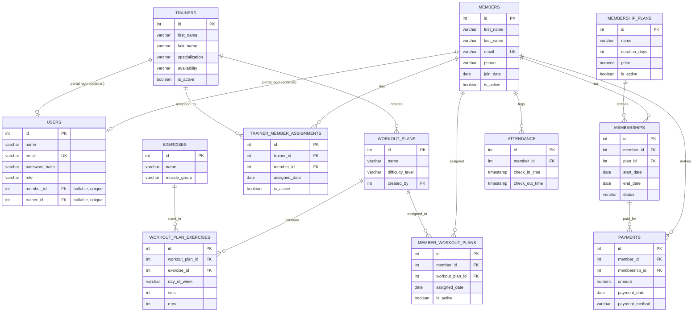

# Gym & Fitness Center Management System — Design Spec

Date: 2026-08-19
Status: Approved by user in chat 2026-08-19

## 1. Objective

A web-based Gym & Fitness Center Management System for a college capstone project. It manages three core modules — Members & Memberships, Trainers & Workout Plans, Attendance & Payments — plus an admin dashboard, on top of a normalized PostgreSQL schema, an Express REST API, and a React (Vite) frontend. Priorities: correctness, clarity, and explainability over feature breadth. No microservices, Docker, Kafka, Redis, GraphQL, WebSockets, or AI/ML.

## 2. Actors

> **Amended 2026-08-25**: extended to a role-based, analytics-driven system (member portal, trainer portal, admin analytics, churn scoring, notifications). This section originally read "Members are not app users. They have no login" — that constraint was deliberately lifted. See `docs/superpowers/plans/` for the extension's phased rollout; Phase 1 (role-based auth) is implemented as of this amendment.

- **Admin** — full access: members, trainers, membership plans, workouts, attendance, payments, dashboard, analytics.
- **Staff** — view/manage members, record attendance, record payments, view (not manage) trainers/workouts.
- **Trainer** — a portal account linked to a `trainers` row (`users.trainer_id`). Can view their assigned members and manage those members' workout plans. No access to admin/staff-only pages (members list, payments, other trainers, etc.).
- **Member** — a portal account linked to a `members` row (`users.member_id`). Can view their own profile, membership history, workout plan, attendance, and payments. No access to any other member's data or to admin/staff pages.

Trainer and member accounts are opt-in: a `members`/`trainers` row can exist with no linked login (as before), and an admin grants portal access explicitly by creating the linked `users` row with an initial password (self-service signup is not implemented — see the extension plan for why).

## 3. Modules & Features

### Module 1 — Members & Memberships
- Register / edit / view / search / filter members
- Activate / deactivate members
- CRUD membership plans (name, duration, price)
- Assign a plan to a member → creates a `memberships` row (start date, computed end date)
- Renew a membership → **inserts a new `memberships` row**, never overwrites the old one, so membership history is preserved
- List active/expired memberships; view a member's full membership history

### Module 2 — Trainers & Workouts
- CRUD trainers (name, specialization, availability, active flag)
- Assign a trainer to a member (many-to-many via `trainer_member_assignments`, with an `is_active` flag so history isn't lost when reassigned)
- CRUD exercises (name, muscle group)
- Build workout plans from exercises with day/sets/reps (`workout_plan_exercises`)
- Assign a workout plan to a member (many-to-many via `member_workout_plans`)
- View a member's assigned workout plan(s)

### Module 3 — Attendance & Payments
- Check in a member (creates `attendance` row with `check_in_time`)
- Check out (fills `check_out_time` on the same row)
- **Block check-in if the member has no currently active, non-expired membership**
- View attendance history, search by member, daily/monthly views
- Record a payment (amount, date, method) tied to a member and a specific `memberships` row
- View payment history; view memberships that are pending/expiring/expired
- Generate a simple receipt view for a payment

### Dashboard
Stat cards: total members, active members, expired memberships, total trainers, today's attendance, memberships expiring in the next 7 days, recent payments, monthly revenue. One or two simple charts (e.g., revenue by month) using Recharts — no complex real-time analytics.

## 4. Business Rules

1. **Membership history is append-only.** Renewing a membership inserts a new `memberships` row rather than mutating `start_date`/`end_date` on the existing one. This lets us show a full history and matches real gym record-keeping.
2. **Check-in requires an active membership.** Before creating an `attendance` row, the API checks for a `memberships` row for that member with `status = 'active'` and `end_date >= today`. If none exists, the request is rejected with a clear error.
3. **A member can have at most one active trainer assignment at a time**, but a full history of past assignments is kept (`is_active` flag rather than deleting rows).
4. **A trainer can have many members; a member can have one active trainer** (one-to-many in practice, modeled as many-to-many for history).
5. **A workout plan is reusable** — the same plan (e.g. "Beginner Strength") can be assigned to multiple members; exercises within a plan carry their own day/sets/reps via the junction table.
6. **Payments always reference both a member and a membership**, so revenue and payment history can be tied back to a specific plan period.
7. **Required-field and uniqueness validation**: member email/phone required and unique where applicable; no duplicate active membership per member; numeric fields (price, sets, reps, amount) validated as positive numbers.
8. **Soft deactivation, not deletion.** Members and trainers are deactivated (`is_active = false`) rather than deleted, to preserve referential history in attendance/payments/assignments.

## 5. Database Design

Chosen approach: plain `pg` (node-postgres) with hand-written parameterized SQL queries — no ORM. This keeps every query visible and explainable for a viva, and directly satisfies the "parameterized SQL queries" requirement without an abstraction layer hiding the SQL.

### Entities

| Table | Key columns | Notes |
|---|---|---|
| `users` | id PK, name, email UK, password_hash, role (admin/staff/trainer/member), member_id FK→members (nullable, UK), trainer_id FK→trainers (nullable, UK) | login accounts; member_id/trainer_id link a portal account to its record (added in the role-based auth extension, migration 001) |
| `members` | id PK, first_name, last_name, email UK, phone, dob, gender, address, join_date, is_active | |
| `membership_plans` | id PK, name, description, duration_days, price, is_active | catalog |
| `memberships` | id PK, member_id FK, plan_id FK, start_date, end_date, status | one row per period; history preserved |
| `trainers` | id PK, first_name, last_name, email UK, phone, specialization, availability, is_active | |
| `trainer_member_assignments` | id PK, trainer_id FK, member_id FK, assigned_date, is_active | junction, many-to-many |
| `exercises` | id PK, name, description, muscle_group | catalog |
| `workout_plans` | id PK, name, description, difficulty_level, created_by FK→trainers | |
| `workout_plan_exercises` | id PK, workout_plan_id FK, exercise_id FK, day_of_week, sets, reps | junction |
| `member_workout_plans` | id PK, member_id FK, workout_plan_id FK, assigned_date, is_active | junction, many-to-many |
| `attendance` | id PK, member_id FK, check_in_time, check_out_time | |
| `payments` | id PK, member_id FK, membership_id FK, amount, payment_date, payment_method, status | |

### Relationships
- `members` 1→N `memberships`; `membership_plans` 1→N `memberships`
- `members` ↔ `trainers` many-to-many via `trainer_member_assignments`
- `workout_plans` ↔ `exercises` many-to-many via `workout_plan_exercises`
- `members` ↔ `workout_plans` many-to-many via `member_workout_plans`
- `members` 1→N `attendance`
- `members` 1→N `payments`; `memberships` 1→N `payments`

### ER Diagram



## 6. System Architecture

3-tier: React (Vite) SPA → Express REST API (JWT auth middleware + role-check middleware) → PostgreSQL (local instance, PostgreSQL 15 via Homebrew, already installed). Secrets (DB credentials, JWT secret) live in `server/.env`, excluded from git via `.gitignore`. CORS restricted to the Vite dev origin. Passwords hashed with bcrypt; JWT issued on login, verified on protected routes; role middleware gates Admin-only endpoints (trainers/workouts/plans management) vs Admin+Staff endpoints (members/attendance/payments).

## 7. Folder Structure

```
gym-management-system/
├── server/
│   ├── src/
│   │   ├── config/        # db.js (pg Pool), env loading
│   │   ├── middleware/    # auth.js, authorize.js, errorHandler.js
│   │   ├── routes/        # one file per resource
│   │   ├── controllers/   # business logic per resource
│   │   ├── db/             # parameterized SQL query functions per entity
│   │   └── app.js
│   ├── package.json
│   └── .env (gitignored)
├── client/
│   ├── src/
│   │   ├── api/            # fetch wrappers per resource
│   │   ├── components/     # Sidebar, Header, StatCard, DataTable, Modal, ConfirmDialog
│   │   ├── pages/          # Login, Dashboard, Members, MemberDetails, Plans, Memberships, Trainers, WorkoutPlans, Exercises, Attendance, Payments, Reports
│   │   ├── context/         # AuthContext
│   │   └── App.jsx
│   ├── package.json
│   └── vite.config.js
├── database/
│   ├── schema.sql          # DDL for all tables
│   └── seed.sql             # demo data (admin user, sample plans/exercises)
├── docs/                    # this spec, ER diagram, later viva prep
└── README.md
```

## 8. Tech Stack Defaults

- Frontend: React + Vite (JavaScript, not TypeScript), Tailwind CSS
- Backend: Node.js + Express
- DB access: `pg` (node-postgres), parameterized queries, no ORM
- Auth: JWT + bcrypt
- Charts: Recharts (dashboard only)
- Package manager: npm
- No Docker — PostgreSQL runs locally (already installed, confirmed running)

## 9. Roadmap

Phases 1–2 (requirements, DB design) are this document. Remaining: Phase 3 project setup → Phase 4 DB schema → Phase 5 backend API → Phase 6 auth → Phase 7 Module 1 → Phase 8 Module 2 → Phase 9 Module 3 → Phase 10 dashboard → Phase 11 testing → Phase 12 UI polish → Phase 13 docs/viva prep. Detailed step-by-step tasks are in the implementation plan.
